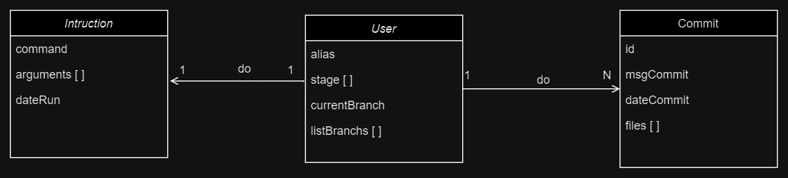

# SimulatorGit

El repositorio contiene dos proyectos relacionados con la simulación de funcionalidades básicas de Git:

- **SisorgGit:** Una aplicación de consola desarrollada en .NET que simula funciones básicas de Git como `add`, `status`, `push`, `commit`, etc.

- **TestSimuladorGit:** Un proyecto de xunit que contiene pruebas unitarias para verificar el correcto funcionamiento de las funciones implementadas en SisorgGit.

Estos dos proyectos forman una solución completa para el desarrollo y la verificación de un simulador de Git en .NET.

## Requisitos para su ejecución

- .NET SDK instalado en tu sistema ([Instrucciones de instalación](https://dotnet.microsoft.com/download))
- Visual Studio o Visual Studio Code (opcional)

## Pasos para Ejecutar la Aplicación

1. **Clona el Repositorio:**
`git clone https://github.com/a-luizaga/Sisorg-Simulator-Git.git`

2. **Navega al Directorio del Proyecto: (se debe estar dentro del directorio SisorgGit que es la que contiene la aplicacion del simulador)**
`cd ruta/al/proyecto/SisorgGit`
	
3. **Compila el Proyecto:**
`dotnet build`

4. **Ejecuta la Aplicación:**
`dotnet run`

## Funcionalidades Solicitadas

- `add <archivo>`: Agrega un archivo al área de preparación. Tambien se puede argegar varios archivos de la siguiente forma: `add nameFile1 nameFile2`
- `commit -m <mensaje>`: Realiza un commit con los archivos en el área de preparación.
- `push`: Envia los commits locales a un servidor remoto.
- `log`: Muestra el registro de commits locales.

## Funcionalidades Adicionales
- `status`: Muestra los arhivos que se encuentran en el área de preparación.
- `reset <archivo>`: Quita un archivo especifico. Se puede quitar todos los archivos si no se pasa como argumento ningun archivo.
- `remote`: Muestra el registro de commits del server remoto.

## Diagrama de clases

## Ejecución de Tests

Para ejecutar los tests unitarios, sigue estos pasos:

1. Navega al directorio del proyecto de tests (TestSimuladorGit):
`cd TestSimuladorGit`
2. Ejecuta el comando de dotnet test:
`dotnet test`

Esto ejecutará todos los tests unitarios en el proyecto y mostrará los resultados en la consola.

## Pruebas Disponibles

El proyecto de tests incluye pruebas para las siguientes funcionalidades:

- Prueba 1: La funcion add debe agregar archivos al area de preparación.
- Prueba 2: La funcion add no debe agregar archivos repetidos al area de preparación.
- Prueba 3: La funcion reset debe remover el archivo especficado del area de preparación.
- Prueba 4: La funcion reset debe remover todos los archivos del area de preparación si no se le pasa parametros.
- Prueba 5: La funcion commit no debe realizar el commit si no hay archivos en el area de preparación.

## Contacto

Si tienes alguna pregunta o sugerencia, no dudes en ponerte en contacto con el equipo de desarrollo en [dev@example.com](mailto:dev@example.com).

